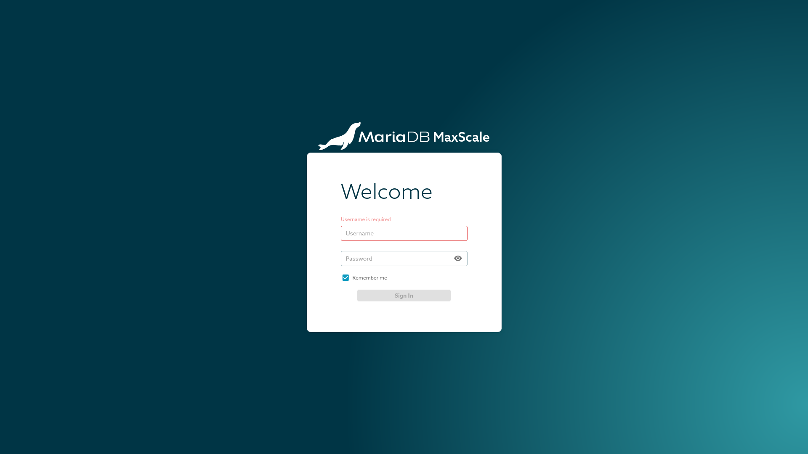
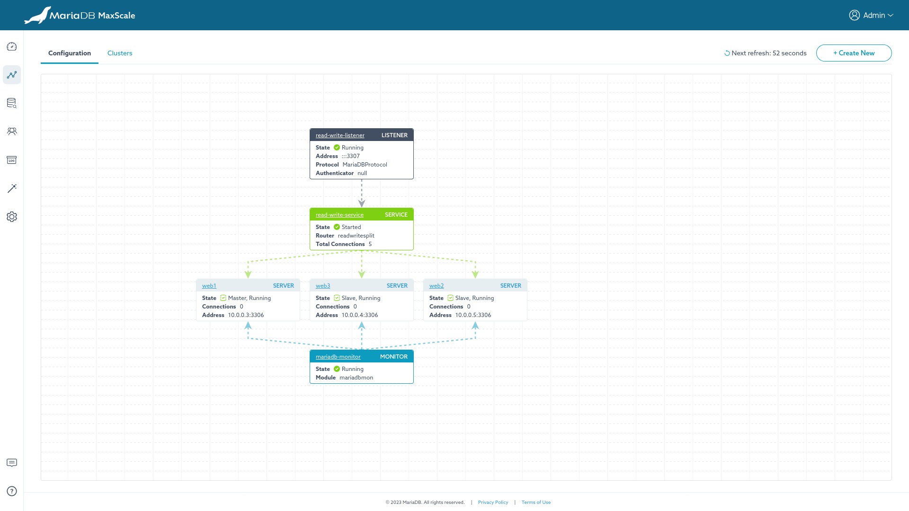
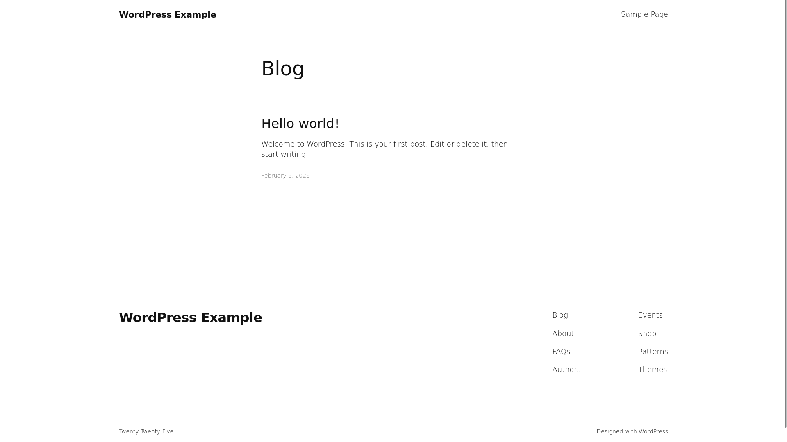
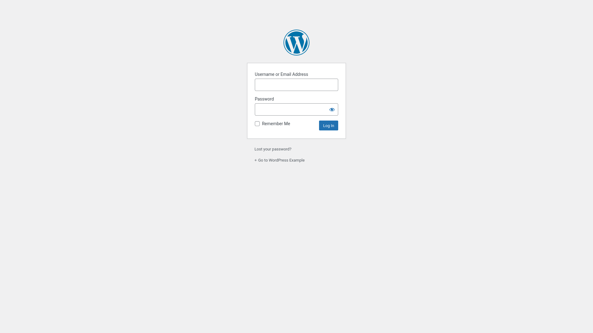
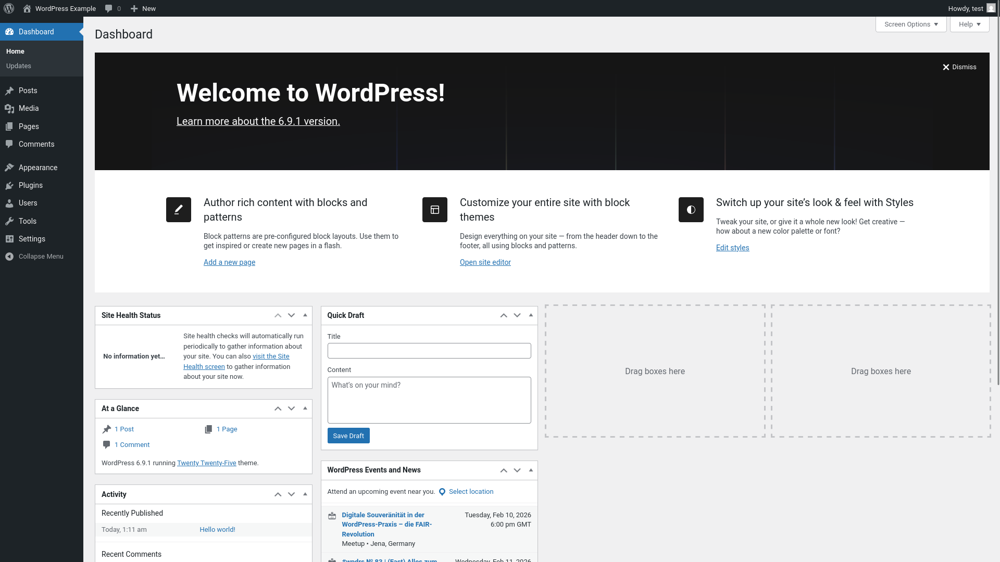
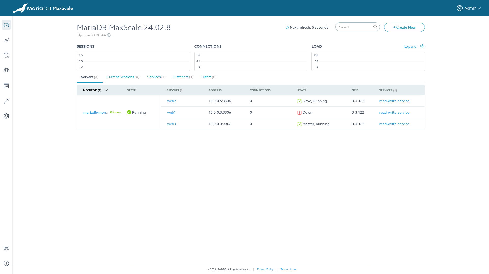
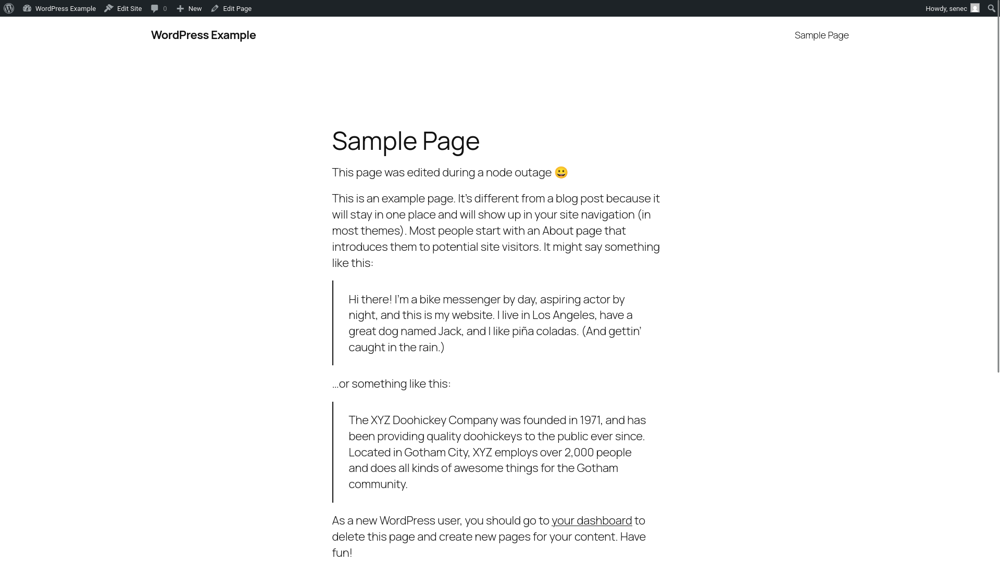

# SENEC Coding Example

## Limitations

- File synchronization of WordPress volume is yet to be decided. While some S3-compatible WordPress plugins exists, they
  would shift the issue to another "magical" S3 node outside of this sketch.  
  [SeaweedFS](https://github.com/seaweedfs/seaweedfs) might be another useful solution.
- More subdomains for debugging purposes, e.g. to interact with Traefik's dashboard etc., would be an useful addition.

## Structural Overview

Active services:

- MariaDB: Open on `ip_internal:3306`.
- MaxScale: Open on `ip_internal:3307` (SQL) and `ip_internal:8989` (web interface).
- WordPress: Open on `ip_internal:80`.
- Traefik (work in progress): Open on `ip_external:80` and `ip_external:443`.

## Getting Started

Requirements:

- [Docker](https://docs.docker.com/engine/install/)
- [Docker Compose](https://docs.docker.com/compose/install/)

**IMPORTANT**: The Ansible container within `docker-compose.yml` requires some sort of SSH keys being mounted as a
readonly volume to location `/ssh-volume`. The user's default SSH key folder at `$HOME/.ssh` is explicitly NOT enabled
by default. **Enable or replace this volume mount with care.**

**IMPORTANT**: For production deployments, the file `./ansible/inventory.yml` must be adapted.

```bash
docker compose build
docker compose up -d
```

## Executing Ansible

All following commands in this section require to be run inside the Ansible container. In order to exec into the
container, execute the following command:

```bash
# host
docker compose exec -it ansible bash
```

### Install Ansible dependencies

```bash
# container
ansible-galaxy collection install -r requirements.yml -p ./galaxy/collections
ansible-galaxy role install -r requirements.yml -p ./galaxy/roles
```

### List Inventory

```bash
# container
ansible-inventory --list
```

### Execute Ansible

```bash
# container
ansible-playbook playbook.yml -l production
```

## Adding New Nodes

Execute the following commands on the new host:

```bash
# root user, new host
apt update
apt upgrade
adduser ansible
usermod -aG sudo ansible
# note: the following command can likely be improved, made more secure etc
install -m 0440 /dev/stdin /etc/sudoers.d/ansible <<'EOF'
ansible ALL=(ALL) NOPASSWD: ALL
EOF
```

```bash
# local machine
ssh-copy-id -i path/to/ssh/key.pub ansible@0.0.0.0 # replace with ip address of new host
```

## MaxScale

MaxScale is an optional companion software for MariaDB deployments, which handles advanced features like load balancing
and automatic fail over. See [official documentation](https://mariadb.com/docs/maxscale/) for more details.

**Important**: MaxScale does support [cooperative monitoring](https://mariadb.com/resources/blog/mariadb-maxscale-2-5-cooperative-monitoring/)
(activated), which can be seen as its "cluster" feature. It does work, and has basic "cluster" capabilities, but it
should be seen more as a group of individual MaxScale instances, which will not block themselves.  
One of the implications is, that MaxScale's web interface is unaware of its peers.  
As the underlying MariaDB cluster is the same for all MaxScale instances, the displayed information is also identical.

### Login

MaxScale's web interface can be reached on `ip:8989`, e.g. http://10.0.0.3:8989/ (web1, internal IP).

The internal ip address can be reached by opening a SSH tunnel, e.g.:

```bash
ssh -L 9000:10.0.0.3:8989 ansible@95.216.155.105 -i /path/to/ssh/key
```

The default credentials are:

```txt
username:    admin
password:    mariadb
```

**Note**: The default credentials are not easily replaceable. For production deployments this should be resolved.



### Dashboard


### Visualization



## WordPress

WordPress is deployed as a Docker container. The initial setup is handled by a sidecar-service, which uses the
`wordpress:cli` Docker image.



### Login

The WordPress login page can be found at `https://domain/wp-login.php`.



### Dashboard



## Outage Test

Stop any database Docker Compose project, e.g. the current primary:

```bash
# node containing the primary instance
cd /srv/database
docker compose down
```

This leads to automatic failover in MaxScale:



Which keeps WordPress active.

Note: The page was edited during the database outage:



And after re-starting the database node:

```bash
# node containing the stopped instance
cd /srv/database
docker compose up -d
```

MaxScale manages all required steps to bring the stopped node up to date and rejoin the cluster:


